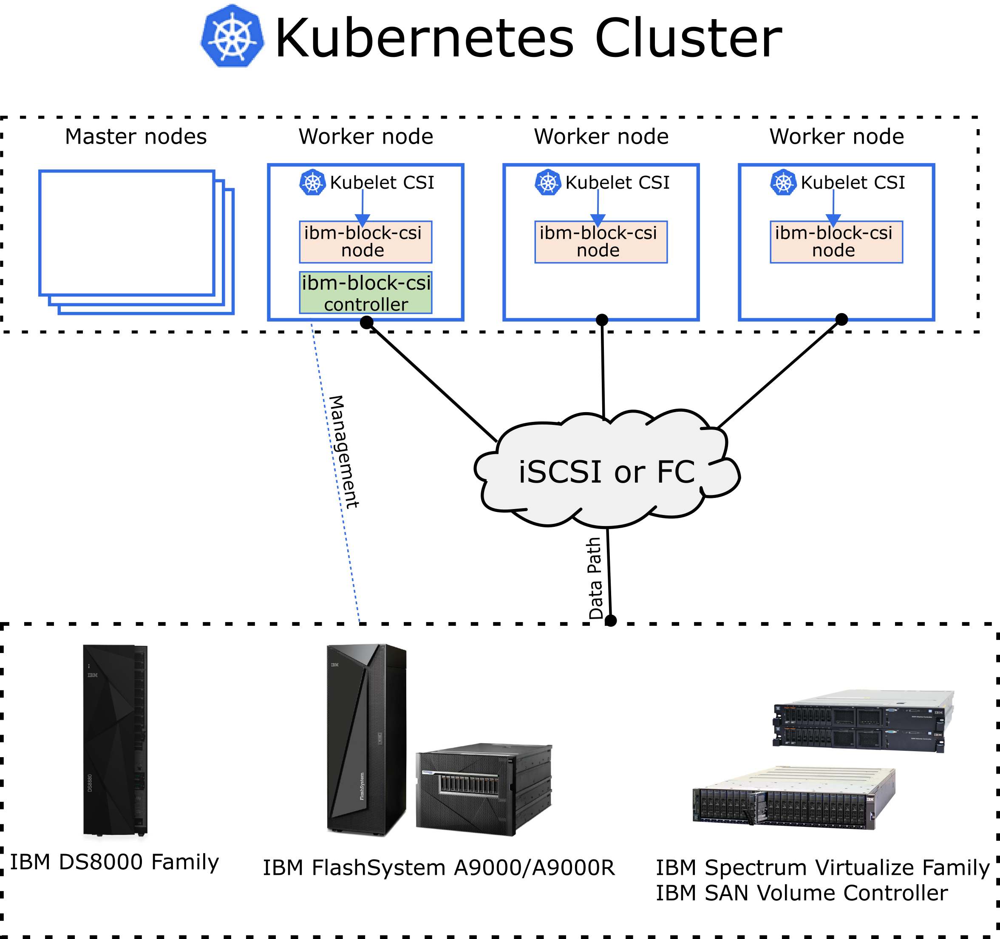

# Overview

IBM® block storage CSI driver is leveraged by Kubernetes persistent volumes (PVs) to dynamically provision for block storage used with stateful containers.

IBM block storage CSI driver is based on an open-source IBM project ([CSI driver](https://github.com/ibm/ibm-block-csi-driver)), included as a part of IBM storage orchestration for containers. IBM storage orchestration for containers enables enterprises to implement a modern container-driven hybrid multicloud environment that can reduce IT costs and enhance business agility, while continuing to derive value from existing systems.

By leveraging CSI (Container Storage Interface) drivers for IBM storage systems, Kubernetes persistent volumes (PVs) can be dynamically provisioned for block or file storage to be used with stateful containers, such as database applications (IBM Db2®, MongoDB, PostgreSQL, etc) running in Red Hat® OpenShift® Container Platform and/or Kubernetes clusters. Storage provisioning can be fully automatized with additional support of cluster orchestration systems to automatically deploy, scale, and manage containerized applications.

IBM storage orchestration for containers includes the following driver types for storage provisioning:

-   The IBM block storage CSI driver, for block storage (documented here).
-   The IBM Spectrum® Scale CSI driver, for file storage. For specific Spectrum Scale and Spectrum Scale CSI driver product information, see [IBM Spectrum Scale documentation](https://www.ibm.com/docs/en/spectrum-scale/).

For details about volume provisioning with Kubernetes, refer to [Persistent volumes on Kubernetes](https://kubernetes.io/docs/concepts/storage/volumes/).

**Note:** For the user convenience, this guide might refer to IBM block storage CSI driver as CSI driver.

